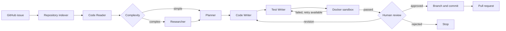

# IssueForge — Multi-Agent GitHub Issue-to-PR Orchestrator


[](https://github.com/KrishnaVarun02/Multi-Agent-Orchestration-System/actions/workflows/ci.yml)

A safety-first Python and LangGraph coding agent that turns a GitHub issue into a
tested, human-reviewed pull request. Specialized agents inspect repository context,
plan a change, generate bounded edits, write regression tests, execute them in an
isolated Docker sandbox, and pause for explicit approval before any branch, push,
or pull-request operation.

The system keeps orchestration, model calls, deterministic validation, execution,
and delivery as separate layers. This makes every transition observable and lets
the workflow stop safely when generated output, tests, budgets, or approvals fail.

## Workflow architecture



LangGraph carries one typed `AgentState` through every node. Nodes return small
state updates; conditional edges decide whether to research, retry, request a
revision, stop safely, or continue toward delivery.

## What the system includes

- Real GitHub issue ingestion with public and authenticated access.
- Repository indexing with ignored files, size limits, and safe path checks.
- OpenRouter-powered Code Reader, Planner, Code Writer, and Test Writer agents.
- Strict Pydantic schemas and bounded structured-output retries.
- Prompt-injection boundaries that treat issue text and source code as data.
- Deterministic unified-diff generation and path validation.
- A non-root, offline, resource-limited, read-only Docker test sandbox.
- SQLite LangGraph checkpoints for review and later resume.
- Bounded test-repair and human-revision loops.
- Human approval before any branch, push, or pull-request operation.
- Token budgets, estimated cost budgets, per-agent usage, response traces, and
  per-node timing.
- Secret-safe JSON workflow reports, CI, and executable security invariants.

## Requirements

- Python 3.12 or 3.13
- Git
- An OpenRouter API key
- Docker Desktop or Rancher Desktop for isolated test execution
- GitHub CLI (`gh`) authenticated with write access only when creating a PR

Reading a public GitHub issue does not require a GitHub token. Private repositories
require a suitable `GITHUB_TOKEN`. PR creation uses the GitHub CLI credential store
and deliberately removes `GITHUB_TOKEN` from that subprocess environment.

## Installation

```bash
git clone https://github.com/KrishnaVarun02/Multi-Agent-Orchestration-System.git
cd Multi-Agent-Orchestration-System

python3 -m venv .venv
source .venv/bin/activate
python3 -m pip install -r requirements-dev.txt

cp .env.example .env
```

Add your OpenRouter key to `.env`:

```dotenv
OPENROUTER_API_KEY=replace_with_your_openrouter_api_key
OPENROUTER_MODEL=openai/gpt-5.6-luna
```

Never commit `.env`. It is ignored by Git and checked by the security audit.

## Configuration

The typed configuration loader is `multi_agent_system/settings.py`.

| Variable | Default | Purpose |
| --- | ---: | --- |
| `OPENROUTER_API_KEY` | required | OpenRouter credential |
| `OPENROUTER_MODEL` | `openai/gpt-5.6-luna` | Model routed through OpenRouter |
| `OPENROUTER_TIMEOUT_SECONDS` | `60` | Timeout for one SDK attempt |
| `OPENROUTER_MAX_RETRIES` | `2` | SDK retries for transient API failures |
| `LLM_MAX_TOTAL_TOKENS` | `0` | Stop new calls at this token usage; `0` is unlimited |
| `LLM_INPUT_COST_PER_MILLION` | `0` | Input-token price used for estimates |
| `LLM_OUTPUT_COST_PER_MILLION` | `0` | Output-token price used for estimates |
| `LLM_MAX_COST_USD` | `0` | Stop new calls at this estimated cost; `0` is unlimited |
| `GITHUB_TOKEN` | optional | Read private issues; not used for PR write operations |

CLI budget and price flags override the environment defaults for one new run.

## Command-line interface

Inspect the production CLI without making API calls:

```bash
python3 -m multi_agent_system --help
```

Check local requirements without starting a workflow:

```bash
python3 -m multi_agent_system \
  --repo-path . \
  --execute-tests \
  --preflight-only
```

Build the sandbox image:

```bash
docker build \
  --file docker/Dockerfile.sandbox \
  --tag multi-agent-test-sandbox:latest \
  .
```

Rancher Desktop users should select its Docker context and ensure its CLI is on
the shell path:

```bash
docker context use rancher-desktop
export PATH="$HOME/.rd/bin:$PATH"
```

## Run a real issue safely

Preview a real workflow with Docker tests and human review enabled:

```bash
python3 -m multi_agent_system \
  https://github.com/KrishnaVarun02/Multi-Agent-Orchestration-System/issues/1 \
  --repo-path . \
  --execute-tests \
  --review \
  --max-llm-tokens 10000 \
  --report-file workflow-report.json
```

`--review` permits revision feedback but does not permit a push or PR. To enable
delivery, replace it with `--create-pr`. The CLI then requires an explicit
`approve` decision and asks you to type the target `owner/repository` before any
push.

Cost estimates require the exact rates for your selected OpenRouter model:

```bash
--input-cost-per-million 2.00 \
--output-cost-per-million 8.00 \
--max-llm-cost-usd 0.10
```

These numbers are examples, not current model prices. Use the rates shown for the
specific model and provider you selected.

## Checkpoints and resume

New complete workflows persist checkpoints in `.agent/checkpoints.sqlite3`.

```bash
python3 -m multi_agent_system --list-threads
```

Resume a workflow that is actually marked `waiting_for_review`:

```bash
python3 -m multi_agent_system \
  --resume-thread COPY_THE_REAL_THREAD_ID \
  --decision reject \
  --feedback "Make the patch smaller"
```

Approve and enable delivery only when you have reviewed the patch and tests:

```bash
python3 -m multi_agent_system \
  --resume-thread COPY_THE_REAL_THREAD_ID \
  --decision approve \
  --create-pr
```

Do not type the literal placeholder `COPY_THE_REAL_THREAD_ID`; copy an ID from
`--list-threads` whose status is `waiting_for_review`.

## Testing and security

Run the complete test suite:

```bash
python3 -m pytest -q
```

Run the cost-free end-to-end integration test:

```bash
python3 -m pytest -q tests/test_end_to_end_workflow.py
```

Run the executable security invariants:

```bash
python3 -m multi_agent_system.security_audit
```

GitHub Actions repeats these checks on Python 3.12 and 3.13, then builds and
smoke-tests the Docker sandbox image.

## Safety model

The system separates proposal, execution, and delivery:

1. LLM agents may propose only bounded edits and new pytest files.
2. Python validates schemas, paths, line ranges, syntax, and unified diffs.
3. Tests run from a temporary copy mounted read-only into an offline container.
4. A person reviews the generated code and tests.
5. An isolated Git worktree creates the branch and commit after approval.
6. The PR node verifies repository identity, branch SHA, GitHub authentication,
   and existing PRs before pushing.

The workflow never treats model output as a shell command.

## Observability

Terminal output and optional JSON reports include:

- Execution order and final status
- Token totals and per-agent usage
- Estimated cost and configured budgets
- Model and response identifiers without prompts or generated content
- Accepted and rejected response attempts
- Per-node calls, total duration, and slowest duration
- Generated file lists, test status, approval state, branch, commit, and PR URL

Reports intentionally exclude API keys, prompts, source contents, and generated
patch bodies.

## Real-world validation

The system has been exercised against a public third-party repository and used to
analyze an issue involving wrapped Cisco VLAN output. The workflow ingested the
issue, indexed the repository, selected context, classified complexity, and
generated a structured implementation plan with token and timing telemetry. The
validated change was delivered as
[Network_Automation_Lab PR #57](https://github.com/Robinlee0929/Network_Automation_Lab/pull/57)
after human review and a 2,110-test validation run.

This result is intentionally described as human-in-the-loop: external API or
environment failures stop the graph instead of bypassing safety gates.

## Project structure

```text
multi_agent_system/   Integrated agents, graph, sandbox, GitHub, and safety code
tests/                Unit, integration, security, and workflow tests
docker/               Restricted pytest sandbox image
.github/workflows/    Continuous integration pipeline
```

Key implementation entry points:

- `CHANGELOG.md` — version 1.0.0 feature and security summary
- `.env.example` — safe environment-variable template
- `.github/workflows/ci.yml` — read-only Python and Docker CI pipeline
- `docker/Dockerfile.sandbox` — non-root pytest sandbox image
- `multi_agent_system/cli.py` — complete interactive CLI
- `multi_agent_system/llm_langgraph_workflow.py` — graph construction and routing
- `multi_agent_system/langgraph_workflow.py` — typed shared agent state
- `multi_agent_system/settings.py` — typed environment configuration
- `tests/test_end_to_end_workflow.py` — cost-free full-graph integration test

## Troubleshooting

### `zsh: command not found: python`

Use `python3`, activate `.venv`, and configure your editor to use
`.venv/bin/python`.

### `ModuleNotFoundError: multi_agent_system`

Run modules from the repository root:

```bash
python3 -m multi_agent_system
```

Do not execute `multi_agent_system/__init__.py` directly.

### GitHub API returns `401 Bad credentials`

Your optional `GITHUB_TOKEN` is invalid or expired. Replace it with a valid token,
or remove it when reading public issues.

### Docker is unavailable

Start Docker Desktop or Rancher Desktop, verify `docker context show`, and build
`multi-agent-test-sandbox:latest` before using `--execute-tests`.

### Structured output is rejected

The workflow records the rejected response, retries once with corrective feedback,
and stops safely after the bounded limit. Review the response trace, selected model,
token budget, and cost budget in the terminal or JSON report.

## Current limitations

- Agents run sequentially; independent agent parallelism is not implemented.
- Code Writer edits existing selected files; Test Writer creates focused new tests.
- Cost values are estimates based on user-supplied rates, not billing records.
- A completed response can cross a budget because usage is known only afterward;
  all later calls are blocked.
- Human review remains mandatory for delivery by design.
